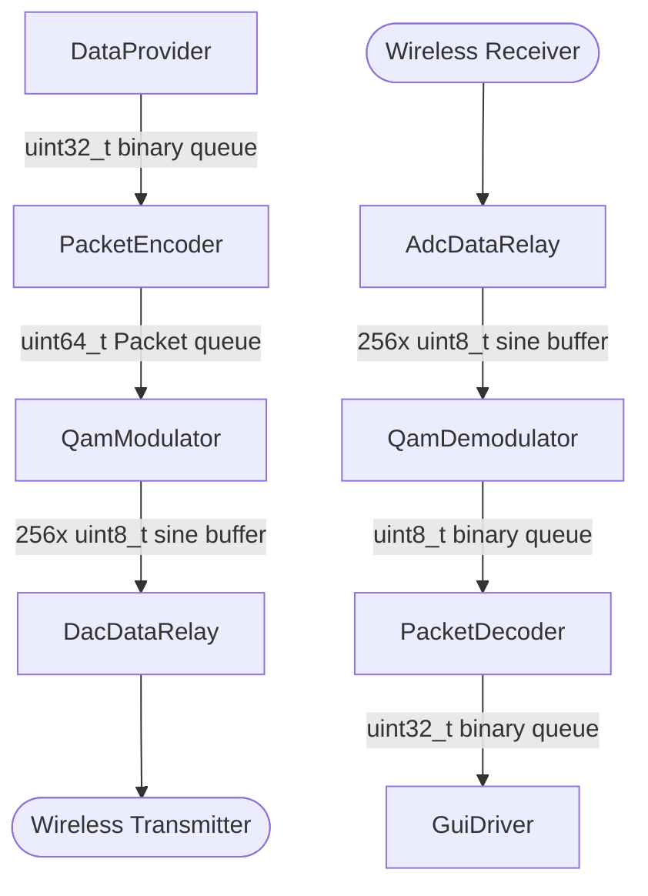

# Component Diagram

# Protocol specification
| byte # | content   | description                                                                |
|--------|-----------|----------------------------------------------------------------------------|
| 1      | SYNC      | pulse to synchronize the pulse as well as the amplitude of the signal      |
| 2      | CMD       | describes the type of data being transmitted                               |
| 3      | PARAM     | can be used differntly depending on CMD, but is mainly used as an iterator |
| 4      | DATA 1    | data byte 1 (MSB)                                                          |
| 5      | DATA 2    | data byte 2                                                                |
| 6      | DATA 3    | data byte 3                                                                |
| 7      | DATA 4    | data byte 4 (LSB)                                                          |
| 8      | CHECKSUM  | calculated checksum to confirm package validity                            |

## CMD Byte Description
The first hex digit of the CMD byte represents the general command type and the second digit reprents it's revision or variant.
| hex value | Packet Type   | description                                                                         |
|-----------|---------------|-------------------------------------------------------------------------------------|
| 0x0X      | Internal      | This type is for internal signaling between transmitter and receiver                |
| 0x1X      | Temperature   | This type is for sending temperature data                                           |
| 0x10      | Temperature   | This command sends temperature data in the form of a float cast into a uint32_t     |
| 0x2x      | Text          | This type is for sending text data                                                  |
| 0x20      | Text          | This command sends text in the form of 4 ascii encoded characters(char) per command |
| 0x3X      | Input         | This type is for sending input data                                                 |

# Module Documentation
## DataProvider
### Description
This module provides data to PacketEncoder. It is currently only planned to support an internal buffer with test data, but more options like sending sensor data can be added in the future.
### API
<b>void DataProvider_init();</b> 
This function initializes the module

## PacketEncoder
### Description
This module takes raw data input in via it's receive function and translates it into binary packages.
### API
<b>void PacketEncoder_init();</b> 
This function initializes the module

<b>bool PacketEncoder_receiveData(uint32_t data);</b> 
This function is responsible for feeding the internal package queue in which the data to be translated into packets is stored.

## QamModulator
### Description
This module takes packets and modulates the binary data into a sine wave using QAM modulation.
### API
<b>void QamModulator_init();</b> 
This function initializes the module

<b>bool QamModulator_receivePacket(uint64_t packet);</b> 
This function is responsible for feeding the internal package queue in which the packets to be modulated are stored.

## DacDataRelay
### Description
This module is symbolic and represents the input of data into the DAC using DMA.
### API
<b>void dac_load_stream_data(uint8_t* dataA, uint8_t* dataB);</b> 
This function is responsible for feeding the DAC with sine wave data

## AdcDataRelay
### Description
This module is symbolic and represents the the interrupt routine triggered by the ADC.
### API

## QamDemodulator
### Description
This module is responsible for demodulating the sine wave signal received by the DAC. 
It is also responsible for terminating incomplete packages.
### API
<b>void QamDemodulator_init();</b> 
This function initializes the module

## PacketDecoder
### Description
This module is responsible for the translating of packages into plain data. 
It provides the decoded data for the GUI.
### API
<b>void PacketDecoder_init();</b> 
This function initializes the module

<b>bool PacketDecoder_receivePacket(uint64_t packet);</b> 
This function is responsible for feeding the internal package queue in which the packages to be translated are stored.

## GuiDriver
### Description
This module displays the received value as well as displaying different statistics on how the system is performing.
### API
#### Init Function
<b>void GuiDriver_init();</b> 
This function initializes the module

<b>bool GuiDriver_receiveTemperature(float temperature);</b> 
This function is responsible for feeding the internal temperature queue with float values.

<b>bool GuiDriver_receiveText(char text[4]);</b> 
This function is responsible for feeding the internal text queue. Each queue element conatins 4 text characters.

<b>bool GuiDriver_receiveDroppedPackets(uint32_t dropped);</b> 
This function is responsible for feeding the internal dropped packets queue. Each queue element the current amount of dropped packets since boot in anuin32_t format.
